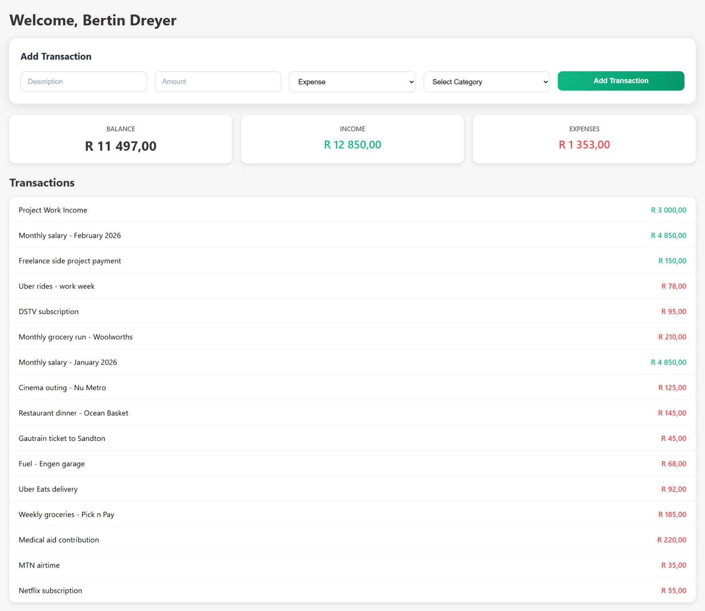

# Personal Budget Tracker

> **New here?** Check the [User-Friendly Guide](PERSONAL-BUDGET-TRACKER.md) for a simple, easy-to-understand overview of this project.



A PERN stack personal finance API and dashboard built to reinforce fintech development patterns. The project implements JWT authentication with refresh token rotation, a REST API with full CRUD operations, and a React dashboard with real-time balance tracking.

## Live Demo

Frontend: **[Deployed on Vercel](https://wallet-dashboard-azure.vercel.app)**
Backend: **[Deployed on Railway](https://personalbudgettracker-production.up.railway.app)**

## Tech Stack

| Layer | Technology |
|-------|------------|
| Runtime | Node.js |
| Framework | Express.js |
| Database | PostgreSQL |
| ORM | node-postgres (pg) |
| Frontend | React 18+ with Vite |
| Authentication | JWT + refresh token rotation |
| Password Hashing | bcrypt (10 rounds) |
| HTTP Client | axios |

## Fintech Design Decisions

### Money as BIGINT Cents

All monetary values are stored as integers representing cents, never as floating-point numbers. Floating-point arithmetic is imprecise in computing: `0.1 + 0.2` evaluates to `0.30000000000000004` in JavaScript. For financial applications, this is unacceptable.

```
R150.75 = 15075 cents
```

The database schema uses `BIGINT NOT NULL CHECK (amount_cents > 0)` to enforce positive values at the database level.

### Idempotency Keys

The transactions table includes an `idempotency_key VARCHAR(100) UNIQUE` column. When a client submits a transaction, it generates a UUID and includes it in the `Idempotency-Key` header. The backend checks for existing transactions with that key before processing. If found, it returns the original result instead of creating a duplicate.

This pattern prevents duplicate charges when network failures cause clients to retry requests. In production fintech systems, this is critical—clients may retry failed requests multiple times, and each retry must produce exactly one transaction.

### Refresh Token Rotation

Access tokens expire after 15 minutes to limit the damage window if a token is compromised. Refresh tokens are stored in the database with an expiration timestamp. When a refresh token is used, it is invalidated and replaced with a new pair of tokens.

This rotation strategy means stolen refresh tokens have limited usefulness—an attacker would need to use the token before the legitimate user does, at which point the stolen token becomes invalid.

### BOLA Protection

Broken Object Level Authorization is the most common vulnerability in financial APIs. Every query that fetches or modifies data includes `AND user_id = $X` where `$X` comes from the decoded JWT payload, never from user-supplied input.

```sql
SELECT * FROM transactions WHERE id = $1 AND user_id = $2
```

The `user_id` parameter comes from `req.user.userId`, populated by the authentication middleware after verifying the JWT signature.

### Parameterised Queries

All database queries use parameterised statements with `$1`, `$2` placeholders. String concatenation is never used, eliminating SQL injection vulnerabilities (OWASP Top 10 #1).

### TIMESTAMPTZ for Timestamps

All timestamp columns use PostgreSQL's `TIMESTAMPTZ` type, which stores timezone-aware timestamps. This prevents subtle date arithmetic bugs when servers or users span multiple timezones.

### Transaction Status Lifecycle

Transactions have a status field with three values: `PENDING`, `COMPLETED`, and `FAILED`. Financial transactions are not binary—payments may be initiated but not yet confirmed, or they may fail after initial processing. This lifecycle enables proper handling of async payment flows.

## Security Implementation

| Feature | Implementation |
|---------|----------------|
| Access tokens | JWT, expires in 15 minutes |
| Refresh tokens | Stored in database, rotated on use |
| Password hashing | bcrypt, 10 rounds |
| Authorization | BOLA protection on all endpoints |
| SQL injection | Parameterised queries only |
| CORS | Restricted to frontend origin |
| Secrets | All stored in environment variables |

## API Reference

### Authentication

| Method | Endpoint | Description |
|--------|----------|-------------|
| POST | /auth/register | Create new user account |
| POST | /auth/login | Authenticate and receive tokens |
| POST | /auth/refresh-token | Exchange refresh token for new access token |
| POST | /auth/logout | Invalidate refresh token |

### Transactions

| Method | Endpoint | Description |
|--------|----------|-------------|
| GET | /transactions | List all transactions for authenticated user |
| GET | /transactions/:id | Get single transaction by ID |
| POST | /transactions | Create new transaction (requires Idempotency-Key header) |
| PATCH | /transactions/:id/status | Update transaction status |

### Request/Response Formats

**POST /transactions**
```
Headers: Authorization: Bearer <access_token>
         Idempotency-Key: <uuid>
Body: {
  "amount_cents": 15075,
  "description": "Groceries",
  "type": "expense",
  "category": "food"
}
Response: {
  "success": true,
  "data": {
    "id": 1,
    "amount_cents": 15075,
    "description": "Groceries",
    "type": "expense",
    "category": "food",
    "status": "completed",
    "created_at": "2024-01-15T10:30:00Z"
  }
}
```

## Challenges and Solutions

### dotenv Loading Order

**Problem**: Environment variables were undefined when pool.js tried to connect to the database.

**Solution**: Moved `import 'dotenv/config'` to be the first import in app.js, ensuring configuration loads before any module attempts to read process.env.

### BIGINT Returned as String

**Problem**: node-postgres returns BIGINT columns as JavaScript strings to avoid integer overflow (JavaScript's Number type loses precision above 2^53 - 1).

**Solution**: Used PostgreSQL's type cast in queries: `amount_cents::int`. This tells PostgreSQL to return the value as an integer, which node-postgres can safely convert to a JavaScript number for the small values in a personal budget tracker.

### JWT Secret Validation

**Problem**: jsonwebtoken rejected the initial JWT secret as too short.

**Solution**: Generated a cryptographically random string (64+ characters) for the secret in the .env file.

### Express Route Ordering

**Problem**: The route `/transactions/:id` was matching requests to `/transactions/user/:userId` because Express matches routes in registration order.

**Solution**: Ordered specific routes before parameterized routes. The `/user/:userId` route is registered before `/:id`.

## Local Setup

### Prerequisites

- Node.js 18+
- PostgreSQL 14+

### Backend Setup

```bash
# Install dependencies
npm install

# Create .env file
cp .env.example .env
# Edit .env with your database credentials and JWT secrets

# Run database migrations
psql -U <user> -d <database> -f src/db/database.sql

# Seed with sample data (optional)
psql -U <user> -d <database> -f src/db/seed.sql

# Start development server
npm run dev
```

The backend runs on `http://localhost:3000`.

### Frontend Setup

```bash
cd wallet-dashboard
npm install
npm run dev
```

The frontend runs on `http://localhost:5173`.

### Environment Variables

```
# Backend (.env)
DB_USER=your_username
DB_PASSWORD=your_password
DB_HOST=localhost
DB_PORT=5432
DB_NAME=WhateverDBYouWant
JWT_ACCESS_SECRET=your_64_character_random_string
JWT_REFRESH_SECRET=different_64_character_random_string
CORS_ORIGIN=http://localhost:5173
PORT=3000
```

## Planned Improvements

- **TypeScript Migration**: Add type safety across both backend and frontend to catch errors at compile time rather than runtime.
- **Docker Containerisation**: Dockerize both services for consistent deployment and easier local development environment setup.
- **Idempotency Full Enforcement**: Currently the idempotency column exists but enforcement is optional. Future iterations will require an idempotency key for all mutating operations.
- **Frontend Token Refresh**: Currently access tokens expire after 15 minutes and require manual re-login. Implement automatic token refresh using axios interceptors to silently exchange refresh tokens before they expire.
- **Logout Functionality**: Add a logout button to the dashboard that calls POST /auth/logout to invalidate the refresh token and clears local storage on the frontend.
- **Rate Limiting**: Add express-rate-limit to protect authentication endpoints from brute force attacks. Consider per-IP limits for login/register endpoints.
- **Test Suite**: Add unit tests for utility functions and API endpoint tests using supertest. Cover authentication flows, transaction CRUD operations, and error handling paths.
